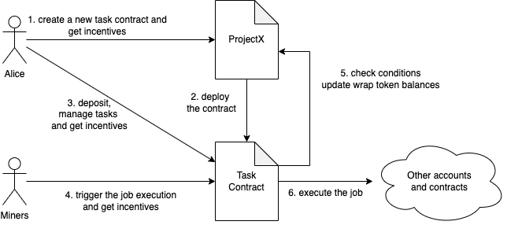

# Decentralized Automated Task Execution Platform

Author: Alvin Wo

Date: 2023-02-25

Updated at: 2023-04-22

## Introduction

This project is an automated task execution system on the Ethereum blockchain. Users can deploy their own task execution contracts and submit tasks and execution conditions. When the conditions are met, the system will automatically execute the task, eliminating the need for users to constantly monitor their devices or rely on centralized exchanges. Users have full control to manage their own decentralized automated task system, equivalent to having their own automated investment trading engine, trust fund, and decentralized will execution program.

In addition, this is an open system, and users can develop more scenarios on it.

## User Workflow
1. Deploy your own automated task execution contract on the Ethereum. Only the contract creator can perform subsequent management operations on the contract.
2. Deposit funds to the contract.
3. Create automated tasks and set trigger conditions. Conditions can be set based on time, block height, or interaction data with other contracts.
4. When the conditions are met, external miners interact with your contract as a trigger to execute specific tasks.

## Implementation
All the tasks and conditions of the automated task contracts are on Ethereum. Miners can obtain all information about automated contracts and tasks through the program interface provided by the platform or by scanning the contract interface on Ethereum. When the conditions of tasks are met, miners submit transactions to trigger the execution of the task. The contract will execute the first transaction request received and reward the miners who submitted the transaction.

## Token Model
Our decentralized automated task platform will use two types of tokens: wrap tokens and governance tokens. Wrap tokens are used to facilitate users' understanding of the deposited assets on their automated task contracts in their wallets. Governance tokens are used to incentive users, pay transaction fees and vote for governacne proposals.

### Wrap Tokens
Wrap tokens are ERC-20 tokens, with each wrap token representing a specific asset type. When users deploy a contract, a wrap token is automatically created to record the user's equity in their investment portfolio in the automated task contract. Users can view the total value of all their wrap tokens in their wallets and understand their assets in the contract.

### Governance Tokens
Governance tokens are fungible tokens used to incentive users, pay transaction fees and vote for governacne proposals. Users will receive a certain number of governance tokens when deploying automated task contracts and managing automated task and when their tasks are executed. In addition, the miner who interacts with the contract to trigger the execution of the transaction each time will also receive governance tokens.

